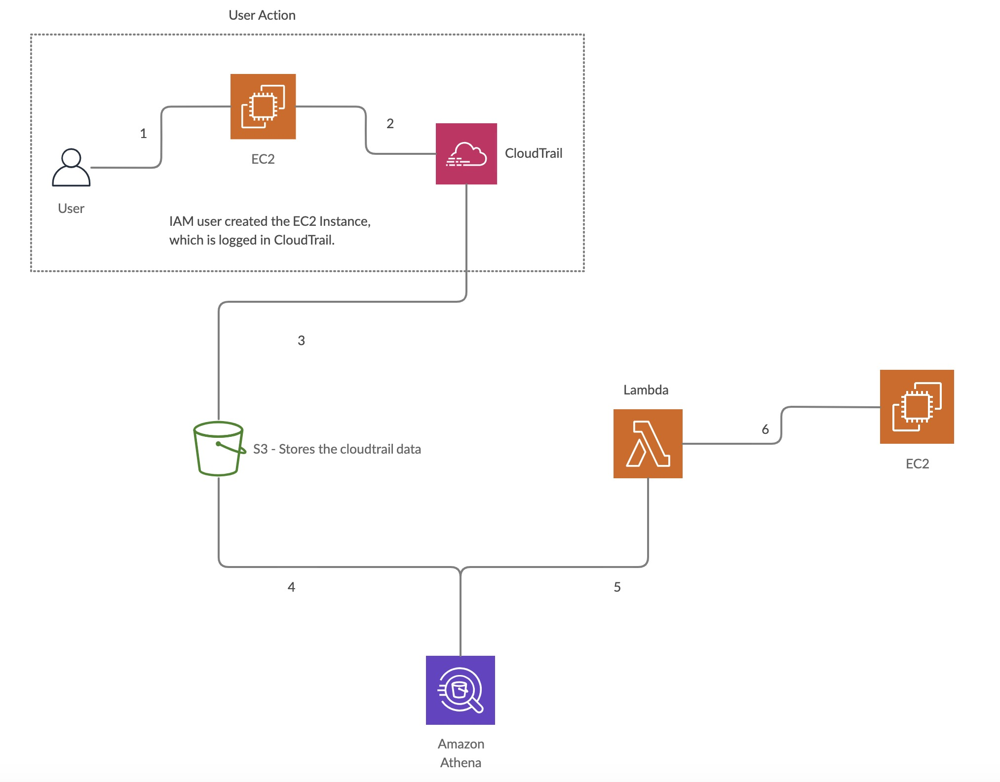

#Create tag named 'Launced By' and provide value as username who launched the machine.

Action Steps:

1. IAM User launch an EC2 Instance.
2. Action is logged under 'RunInstances' action in cloudtrail.
3. Create a trail in Cloudtrail to upload all the actions in S3 bucket.

Above 3 steps are typical userend action. Below are the actions which are required to tag the instance.

4. Cloudtrail uploads all the logs in an S3 bucket.
5. Create athena table (partioned table - for low cost and better performance) for cloudtrail S3 bucket.
6. Lambda function which runs python script will load the partitions on daily basis and query the athena table on                'RunInstances' event and tag the instances with username who launched it.
